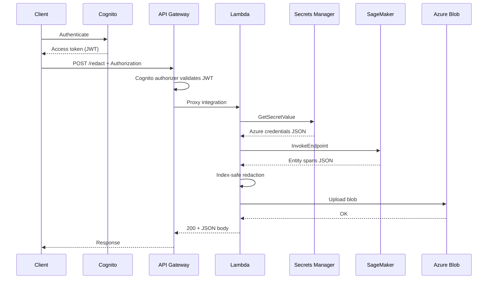

# Hybrid AWS–Azure PII redaction architecture

## Workflow

1. **Client** signs in with **Amazon Cognito** (SRP or hosted UI) and receives JWTs.
2. **Client** calls **Amazon API Gateway (REST)** `POST /redact` with header `Authorization: Bearer <access_token>` (or raw token, depending on client).
3. **API Gateway** validates the JWT using a **Cognito User Pool authorizer** before invoking Lambda.
4. **AWS Lambda** parses JSON `{"text": "..."}`, calls **Amazon SageMaker** real-time `InvokeEndpoint`, maps spans to placeholders with **end-to-start replacement**, then uploads UTF-8 text to **Azure Blob Storage** using credentials from **AWS Secrets Manager**.
5. **Response** JSON includes `blob_path`, `container`, `entity_count`, and `request_id`.

## Components

| Service | Role |
|---------|------|
| Cognito User Pool | Identity; issues JWTs |
| API Gateway + Cognito authorizer | Authentication at the edge; throttling (optional usage plans / WAF) |
| Lambda | Orchestration, redaction, Azure SDK upload |
| SageMaker endpoint | Returns `{ "entities": [ { "start", "end", "type" }, ... ] }` (adjust parsing if your contract differs) |
| Secrets Manager | Azure `connection_string` or `account_url` + `sas_token` JSON |
| CloudWatch Logs | Lambda and API access logs (enable if required) |
| Azure Blob | Durable storage for redacted artifacts |

## Sequence

## Cross-cloud considerations

- **Latency:** SageMaker then Azure is two network hops; use async patterns for large jobs (see `ASYNC_AND_OBSERVABILITY.md`).
- **Security:** No Azure secrets in code or environment literals beyond the **ARN** of the secret. Prefer **short-lived SAS** in the secret and rotation.
- **Compliance:** Data leaves AWS for Azure storage; align with retention, encryption (SSE on blob), and DPAs.

## Repository layout

- `lambda/` — Handler and libraries; build produces `deployment.zip`.
- `terraform/` — Cognito, API Gateway, Lambda, IAM, Secrets Manager secret **container**.
- `iam/` — Human-readable policy template and example secret JSON shape.
- `scripts/` — Zip packaging for Lambda layers dependencies.
